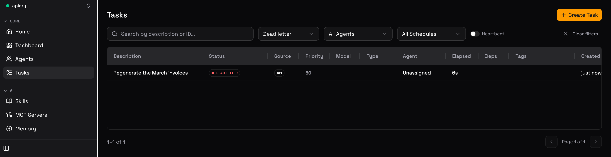
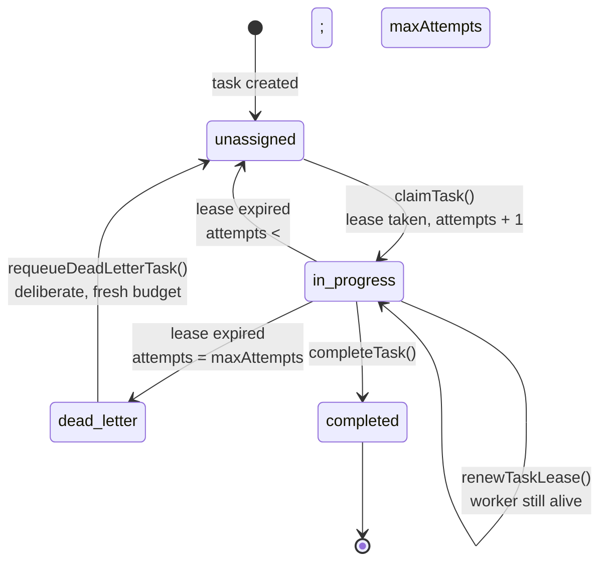

<div align="center">

# apiary

### Keeps a team of AI coding agents working when one of them crashes

**A worker takes a task and dies halfway through. The code this was forked from called the task failed and moved on.**
**apiary hands it to another worker, and after three failed tries parks it for a person to decide.**

<br/>

[](#the-thirty-second-version)

**A real run.** A task that ran out of tries, waiting in the dashboard's Dead letter list.
[The thirty-second version](#the-thirty-second-version) · [Run it yourself](#quick-start)

<br/>

[](https://bun.sh)
[](./LICENSE)
[](#what-is-inherited-and-what-is-not)
[](#what-is-inherited-and-what-is-not)
[](https://github.com/patkusch/apiary/actions/workflows/ci.yml)

<sub>Two test numbers, deliberately: 90 tests were written for this fork and the other 3,691 came with the code it grew from. <a href="#what-is-inherited-and-what-is-not">Full accounting below.</a></sub>

</div>

---

## The thirty-second version

A team of AI coding agents takes jobs from one shared list. Two stand-in workers, worker-a and worker-b, ask apiary for work. To keep the run short, a worker that stays silent for 1.5 seconds loses its task, and the server checks once a second. The real settings are 10 minutes and 90 seconds.

The first job is "Rename the old config flag everywhere". worker-a takes it, then stops answering, the way a crashed program does. worker-a is first in line for new work, and the server still skips it: a worker that just lost a job is not given work again until it is heard from.

```
task a224a679  "Rename the old config flag everywhere"
+ 0.3s  unassigned    attempts 0 of 3  in the pool, nobody has it yet
+ 0.6s  in_progress   attempts 1 of 3  worker-a has it
+ 2.5s  unassigned    attempts 1 of 3  worker-a went quiet, so it went back to the pool
+ 3.4s  in_progress   attempts 2 of 3  worker-b has it
+ 3.7s  completed     attempts 2 of 3  worker-b finished it
```

The job did not vanish. It kept its number, went back to the pool (the shared list of waiting jobs), and worker-b finished it on the second try.

The second job, "Regenerate the March invoices", makes every worker that takes it go silent. Each time it goes back to the pool, a worker comes back and asks for work, the way a crashed program restarted by its supervisor does. apiary gives the job three tries and then stops instead of trying forever.

```
task 5192b623  "Regenerate the March invoices"
+ 3.7s  unassigned    attempts 0 of 3  in the pool, nobody has it yet
+ 4.0s  in_progress   attempts 1 of 3  worker-a has it
+ 5.5s  in_progress   attempts 2 of 3  worker-b has it
+ 7.3s  unassigned    attempts 2 of 3  worker-b went quiet, so it went back to the pool
+ 7.6s  in_progress   attempts 3 of 3  worker-a has it
+ 9.5s  dead_letter   attempts 3 of 3  parked, waiting for a person
+ 9.5s  GET /api/dead-letter-tasks -> 1 task waiting: 5192b623
```

`dead_letter` is a parking place for jobs that ran out of tries. Nothing picks them up on its own. That is the list in the picture above.

A person looks at the job, fixes the cause, and clicks Requeue in the dashboard. The dashboard asks first, then the job goes back to the pool with a fresh set of tries, and the next worker to ask for work takes it.

```
+11.7s  dashboard asks "Requeue Task": This task exhausted its retry budget (3 of 3 attempts). Requeueing returns it to the pool with a fresh budget, so a worker will pick it up again. Do this only if the cause has been fixed.
+12.0s  unassigned    attempts 3 of 6  a person requeued it, back in the pool with a fresh budget
+12.3s  in_progress   attempts 4 of 6  worker-b has it
```

**Real output, captured from `bun docs/make_hero.ts`.** It starts the real server and the real dashboard, and the picture above is a screenshot of that dashboard from the same run. The task numbers and times change on every run. The two workers are stand-ins that talk to the server over its web API and stop answering. No operating-system process is killed, which the [known limitations](#known-limitations) say plainly. It needs Bun and, once, `npx playwright install chromium`.

---

## What this is

apiary is a hard fork of [`desplega-ai/agent-swarm`](https://github.com/desplega-ai/agent-swarm)
(MIT), by way of [`jamalavedra/agent-swarm`](https://github.com/jamalavedra/agent-swarm).
It keeps the lead/worker model, the priority pool, budget admission control,
encrypted secrets and workflows, and changes how task durability works.

### What is inherited, and what is not

Most of this repository is not mine, and the badges above say so. The fork base was
`agent-swarm` v1.76.3 — 300 files and roughly 381,000 lines imported in a single
commit ([`1c1a5c1`](../../commit/1c1a5c1)). Everything since is this fork:

| | Files | Lines | Tests |
|---|---|---|---|
| **Inherited** at v1.76.3 | ~300 | ~381,000 | 3,691 |
| **Written here** (77 files touched) | 16 added, 48 modified, 13 deleted | +3,347 / −3,066 | 90 |

What the 3,347 added lines actually are:

- **The lease state machine** — `059_task_leases.sql`, `task-hooks.ts`, `wiring.ts`,
  and changes to `db.ts`, `heartbeat.ts`, `http/tasks.ts`, `types.ts`. Claim takes a
  lease, renewal extends it, expiry requeues under a retry budget, and `dead_letter`
  is a real terminal state. **21 tests.**
- **The eval harness** — `src/eval/*`, which measures memory retrieval instead of
  asserting it. **39 tests.**
- **Lease fencing and dead-letter surfaces** — the `store-progress` MCP tool refuses
  a task it does not own, `dead_letter` has an API, a dashboard badge and a Requeue
  action, and the heartbeat times out standalone approval requests. **15 tests.**
- **Lost-lease workers are passed over** — a worker whose lease just expired is not
  handed the same task again, or any other, until it is heard from. `060_agent_lease_lost.sql`
  plus small changes to `db.ts`, the heartbeat, `/ping`, `/api/poll` and registration.
  **15 tests.**
- **Deletions** — the crypto-wallet payment scope (x402) removed entirely, which is
  most of the 3,066 deleted lines and 3 of the deleted test files.

The 3,691 inherited tests are upstream's, and I did not write them. I did make them
pass on this fork — one of them, an order-dependent Slack mock, was failing CI and is
fixed in [`69027d1`](../../commit/69027d1). Run `bun test` and you should see 3781
pass, 0 fail.

## The failure mode this exists to solve

When a worker's process dies, or you deploy and the server restarts, the task it
was holding is at risk.

Upstream marked that task `failed` and moved on. There was no lease, no attempt
counter and no requeue path, so the in-flight work was gone and nothing retried
it. Upstream's own heartbeat prompt told the lead agent to go clean up after it:

> Failures with reason "worker session not found" or "worker session heartbeat is
> stale" indicate tasks that were INTERRUPTED by a server restart. These are NOT
> "expected auto-cleanup" — they represent work that was lost mid-execution.

That is a missing state machine described to a language model in prose. apiary
replaces it with a lease.

> **Which upstream, and when.** Everything above is true of the fork base,
> `agent-swarm` v1.76.3 (August 2026). Upstream has not stood still: by v1.136.0 it
> had built its own crash recovery on a different design — `crash_recovery` resume
> tasks pinned back to the original agent, a resume-generation budget, and a
> stale-pin reaper in the heartbeat (`src/tasks/worker-follow-up.ts`), behind
> `HEARTBEAT_PIN_CRASH_RESUME`. So this is **not** a live bug report against current
> upstream, and apiary is not a proposed patch to it. It is a fork that answers the
> same question with a lease in the database rather than a reaper above it — the
> tradeoff being that a lease makes the invariant enforceable at claim time, and the
> reaper makes it recoverable without a schema change.

## See it happen

```bash
bun run demo
```

Real output, captured from that command. Every line is a SQLite write against a
throwaway database, nothing is mocked:

```
apiary durability demo  lease=600s  budget=3 attempts
workers: alice=e0eedd09  bob=f4637a7b

1. A task is leased, and a second worker cannot take it
──────────────────────────────────────────────────────────────────────────
20:17:03.166  · task created a135eb44
20:17:03.166  ✓ alice claimed it, lease held for 600s
            after alice claims     status=in_progress  attempts=1/3  owner=e0eedd09  lease_expires=20:27:03
20:17:03.166  ✓ bob tried to claim the same task and was refused

2. A working worker keeps its task by renewing
──────────────────────────────────────────────────────────────────────────
20:17:03.166  · lease has aged past its expiry
20:17:03.166  ✓ alice renewed the lease, she is still alive
20:17:03.166  ✓ reaper ran and reclaimed 0 task(s), alice keeps her work
            after renewal          status=in_progress  attempts=1/3  owner=e0eedd09  lease_expires=20:27:03

3. A worker dies mid-task and the work survives
──────────────────────────────────────────────────────────────────────────
20:17:03.166  ✗ alice's process dies, holding the task, renewing nothing
            lease lapsed           status=in_progress  attempts=1/3  owner=e0eedd09  lease_expires=20:07:03
20:17:03.166  ✓ reaper requeued the task (outcome=requeued), it is not marked failed
            after reclaim          status=unassigned   attempts=1/3  owner=—  lease_expires=—
20:17:03.166  ✓ bob picked up the same task a135eb44, attempt 2
            after bob claims       status=in_progress  attempts=2/3  owner=f4637a7b  lease_expires=20:27:03
20:17:03.167  ✓ bob finished it: status=completed. No work was lost.

4. A task that keeps killing its worker terminates
──────────────────────────────────────────────────────────────────────────
20:17:03.169  · task created 3bababf1
20:17:03.171  · attempt 1/3 died → requeued
20:17:03.172  · attempt 2/3 died → requeued
20:17:03.172  ■ attempt 3/3 died → dead_lettered
            final                  status=dead_letter  attempts=3/3  owner=—  lease_expires=—
20:17:03.172  ✓ the retry budget is spent, so it stopped rather than looping forever
20:17:03.172  ✓ a dead-lettered task cannot be claimed again without an explicit requeue

──────────────────────────────────────────────────────────────────────────
Done. Nothing above is mocked. Every line is a real SQLite write.
```

## Lease lifecycle



The rules behind it:

- A claim takes a lease and spends one attempt. Both `claimTask` (pool) and
  `startTask` (assigned directly to an agent) do this.
- The worker renews the lease while it works. Renewal is guarded on lease
  ownership, so a worker that was already reaped cannot reclaim a task that has
  moved on.
- A lapsed lease means nobody is working on the task. That is a scheduling fact,
  not a failure, so the task returns to the pool rather than being marked failed.
- Only when the retry budget is spent does the task reach `dead_letter`, which is
  terminal. Progress writes, restarts and completions are all refused there.
  `requeueDeadLetterTask()` is the single way back, because crossing the bound
  should take a decision.
- A server restart reclaims leases the same way. The task keeps its id and its
  attempt count, so restarting does not reset the budget.

Pausing and resuming re-leases without spending an attempt: a graceful shutdown
is a continuation of the same attempt, not a new one.

## Quick start

Verified from a clean clone on Bun 1.4.0.

```bash
bun install
```

```bash
bun test
```

```bash
bun run demo
```

```bash
bun run start:http
```

The API listens on port `3013`, with interactive docs at `http://localhost:3013/docs`.

Configuration, deployment and integration setup are inherited from upstream and
documented in [DEPLOYMENT.md](./DEPLOYMENT.md) and [LOCAL_TESTING.md](./LOCAL_TESTING.md).
Upstream's docs at [docs.agent-swarm.dev](https://docs.agent-swarm.dev) still
apply to everything this fork has not changed.

### Lease configuration

| Variable | Default | Meaning |
|---|---|---|
| `TASK_LEASE_DURATION_MS` | `600000` (10 min) | How long a claim is valid without renewal. Must comfortably exceed the worker session heartbeat interval. |
| `HEARTBEAT_INTERVAL_MS` | `90000` (90s) | How often the reaper runs. |
| `HEARTBEAT_DISABLE` | unset | Set to `true` to stop the reaper. Nothing will reclaim lapsed leases. |

Retry budget is per task via `maxAttempts`, default `3`.

## Measuring the memory claim

Upstream's pitch is that agents "remember everything, learn from every mistake,
and get better with every task". Nothing in the project measured it: 219 test
files, none scoring retrieval.

`bun run eval` scores retrieval against a labelled golden set with deliberate
near-miss distractors, so it can tell real retrieval from keyword overlap:

```
  Golden set    engineering-memories
  Embeddings    hash-bow-v1 (512d)
  Corpus        20 documents, 16 queries

  k      hit@k    recall@k  prec@k   nDCG@k
  ----   ------   --------  ------   ------
  1       31.3%      28.1%   31.3%    31.3%
  3       75.0%      75.0%   27.1%    57.2%
  5       81.3%      81.3%   17.5%    59.6%
  10      87.5%      87.5%    9.4%    61.7%

  MRR           0.532
```

The default embedding provider is a deterministic hashed bag of words. The
production embedder calls the OpenAI API, which needs a key, costs money per run
and drifts when the upstream model changes, and an eval you cannot run on every
commit is an eval nobody runs. It sees lexical overlap only, so treat these
numbers as a floor rather than as production quality. `--provider openai` gives
real numbers. `--min-hit-at 3=0.6` gates CI.

| Flag | Meaning |
|---|---|
| `--set <path>` | Use your own golden set JSON |
| `--provider hash\|openai` | Embeddings, default `hash`, offline |
| `--json` | Emit the full report for CI |
| `--min-hit-at K=F` | Exit non-zero if hit@K drops below fraction F |

## What diverged from upstream

51 of 1553 tracked files, +2038 / −2901. Everything else is upstream's.

| Change | Why |
|---|---|
| Task leases, attempt counting, `dead_letter` | Worker death lost in-flight work |
| Restart reclaims instead of cloning the task | Cloning reset the retry budget and dropped Slack and VCS metadata |
| Dead workers marked offline, not idle | The scheduler handed tasks straight back to a dead process |
| Network I/O out of the persistence layer | `claimTask` fired an HTTP request to GitHub from a SQLite write path |
| `src/x402` removed | A tool with repo write access should not also hold a hot wallet key |
| `apiary eval` | The memory claim was unfalsifiable as shipped |

## Known limitations

Confirmed in the code or by running it. Nothing here is speculative.

**A silent worker is passed over, but only until it says anything.** It used to be
that when a worker went silent and its task went back to the pool, the server still
saw that worker as free, and handed it the task again if it was first in line. A
crashed worker cannot take the task, so that try was wasted, and a task could lose
one of its three tries without another worker ever seeing it. Now the server marks a
worker whose lease just ran out (`leaseLostAt`) and gives it no work until its next
`/ping`, `/api/poll` or registration, so the task goes to another worker. A single
worker is not stranded: the task waits in the pool and goes to it the moment it
answers. If every worker is silent the task waits and uses up no tries. Two limits
remain. A worker that is broken but still pings, for example one whose agent is
stuck while its program keeps answering, counts as alive and can be handed the task
again. And a worker that comes back, or pings, right after losing its lease is
trusted straight away, even when it is first in line, because the server cannot tell
a restarted worker from one that will fail again; the three-try limit is what bounds
that.

**Lease renewal is hook-driven, not timed.** Renewal rides on the `PostToolUse`
hook, so the cadence is however often the agent calls a tool. A worker inside one
long build can exceed `TASK_LEASE_DURATION_MS` while still healthy and have its
task requeued underneath it. Both write paths now refuse the stale worker: the
HTTP finish endpoint returns 403 if the task belongs to another agent, and the
`store-progress` MCP tool refuses a task that is assigned to someone else or to
nobody, and writes nothing. What neither can do is tell a healthy-but-slow
worker from a dead one; that needs a timer-driven heartbeat, which is not built.

**No process-level durability test.** `bun run demo` and the test suite simulate
worker death by letting the lease lapse, which is exactly what the server
observes, but neither kills an operating system process running a real agent.

**`dead_letter` is reachable, but only just.** `GET /api/dead-letter-tasks` lists
parked tasks, `POST /api/tasks/{id}/requeue` is the one way back to the pool, and
the dashboard now shows the status, filters on it, and offers Requeue behind a
confirmation on the task page. The whole flow is now exercised end to end:
`bun run e2e:dead-letter` runs in CI, starting a real server where a crashing
worker gets its task dead-lettered, requeued and picked up again.
`bun run e2e:dashboard` repeats it through the dashboard in headless Chromium,
clicking the Requeue button, so a broken button or heading fails the build (run
`npx playwright install chromium` once first).

**sqlite-vec does not load on macOS or CI.** Both print `sqlite-vec not
available, falling back to in-memory cosine`, so every similarity search runs the
brute-force O(n) path and the eval figures above measure the fallback.

**The default database file is still `agent-swarm-db.sqlite`.** Renaming it would
orphan an existing database on next start, so it has been left alone.

**Inherited and unverified.** Not run by me: the Docker lead and worker images,
the dashboard UI beyond the dead-letter flow that CI clicks through, and
`apiary eval --provider openai`. `package.json` declares
`bun >=1.0.26`; the only version this has run on is 1.4.0. Dependencies use caret
ranges, so reproducibility depends on the committed `bun.lock` with
`--frozen-lockfile`.

**Upstream leftovers.** `CHANGELOG.md` is 100 KB of upstream release history for
versions this fork never shipped. `thoughts/` and `designs/` are upstream's
internal notes.

## Credit

The overwhelming majority of this code was written by the
[desplega.sh](https://desplega.sh) team and contributors to
[`desplega-ai/agent-swarm`](https://github.com/desplega-ai/agent-swarm), and by
[Jaume Alavedra](https://github.com/jamalavedra), whose fork contributed the fix
for a recursive Stop-hook fork bomb. This fork stands on that work and remains
MIT licensed with the original copyright intact.

The critique above is a critique of specific engineering decisions, not of the
project or the people who built it. Shipping something this broad is hard, and
most of it is well made.

## License

[MIT](./LICENSE) — original copyright © 2025–2026 desplega.sh; fork modifications
© 2026 patkusch.
