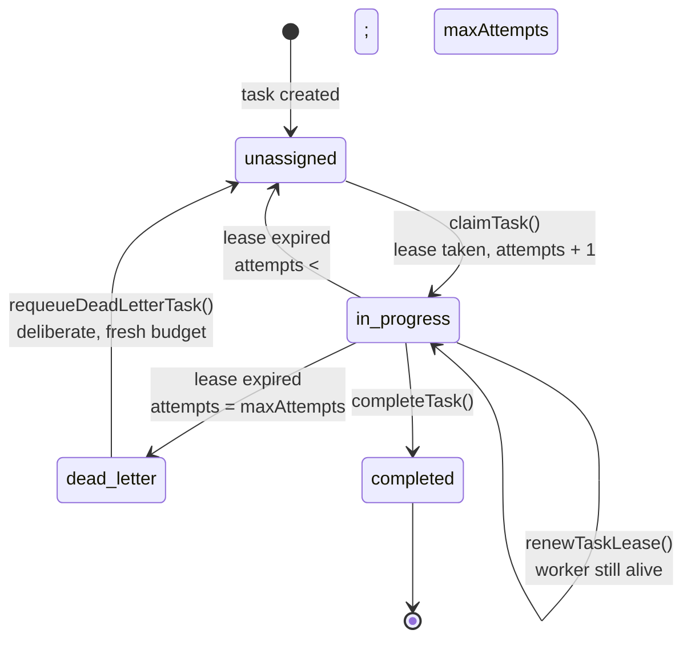

<h1 align="center">apiary</h1>

<p align="center">
  <b>Durable multi-agent orchestration for coding agents.</b><br/>
  <sub>Leased tasks. Bounded retries. No work lost when a worker dies.</sub>
</p>

<p align="center">
  <a href="./LICENSE"></a>
  
  
  
</p>

<p align="center">
  <sub>
    Two numbers, deliberately. <b>60</b> tests were written for this fork — 21 for the
    lease state machine, 39 for the eval harness. The other <b>3,691</b> came with the
    upstream code and are inherited, not authored here.
    <a href="#what-is-inherited-and-what-is-not">Full accounting below.</a>
  </sub>
</p>

---

## What this is

apiary is a hard fork of [`desplega-ai/agent-swarm`](https://github.com/desplega-ai/agent-swarm)
(MIT), by way of [`jamalavedra/agent-swarm`](https://github.com/jamalavedra/agent-swarm).
It keeps the lead/worker model, the priority pool, budget admission control,
encrypted secrets and workflows, and changes how task durability works.

### What is inherited, and what is not

Most of this repository is not mine, and the badges above say so. The fork base was
`agent-swarm` v1.76.3 — 300 files and roughly 381,000 lines imported in a single
commit ([`1c1a5c1`](../../commit/1c1a5c1)). Everything since is this fork:

| | Files | Lines | Tests |
|---|---|---|---|
| **Inherited** at v1.76.3 | ~300 | ~381,000 | 3,691 |
| **Written here** (59 files touched) | 15 added, 20 modified, 24 deleted | +2,683 / −3,031 | 60 |

What the 2,683 added lines actually are:

- **The lease state machine** — `059_task_leases.sql`, `task-hooks.ts`, `wiring.ts`,
  and changes to `db.ts`, `heartbeat.ts`, `http/tasks.ts`, `types.ts`. Claim takes a
  lease, renewal extends it, expiry requeues under a retry budget, and `dead_letter`
  is a real terminal state. **21 tests.**
- **The eval harness** — `src/eval/*`, which measures memory retrieval instead of
  asserting it. **39 tests.**
- **Deletions** — the crypto-wallet payment scope (x402) removed entirely, which is
  most of the 3,031 deleted lines and 3 of the deleted test files.

The 3,691 inherited tests are upstream's, and I did not write them. I did make them
pass on this fork — one of them, an order-dependent Slack mock, was failing CI and is
fixed in [`69027d1`](../../commit/69027d1). Run `bun test` and you should see 3751
pass, 0 fail.

## The failure mode this exists to solve

A worker picks up a task. Halfway through, its process dies, or you deploy and
the server restarts.

Upstream marked that task `failed` and moved on. There was no lease, no attempt
counter and no requeue path, so the in-flight work was gone and nothing retried
it. Upstream's own heartbeat prompt told the lead agent to go clean up after it:

> Failures with reason "worker session not found" or "worker session heartbeat is
> stale" indicate tasks that were INTERRUPTED by a server restart. These are NOT
> "expected auto-cleanup" — they represent work that was lost mid-execution.

That is a missing state machine described to a language model in prose. apiary
replaces it with a lease.

> **Which upstream, and when.** Everything above is true of the fork base,
> `agent-swarm` v1.76.3 (August 2026). Upstream has not stood still: by v1.136.0 it
> had built its own crash recovery on a different design — `crash_recovery` resume
> tasks pinned back to the original agent, a resume-generation budget, and a
> stale-pin reaper in the heartbeat (`src/tasks/worker-follow-up.ts`), behind
> `HEARTBEAT_PIN_CRASH_RESUME`. So this is **not** a live bug report against current
> upstream, and apiary is not a proposed patch to it. It is a fork that answers the
> same question with a lease in the database rather than a reaper above it — the
> tradeoff being that a lease makes the invariant enforceable at claim time, and the
> reaper makes it recoverable without a schema change.

## See it happen

```bash
bun run demo
```

Real output, captured from that command. Every line is a SQLite write against a
throwaway database, nothing is mocked:

```
apiary durability demo  lease=600s  budget=3 attempts
workers: alice=e0eedd09  bob=f4637a7b

1. A task is leased, and a second worker cannot take it
──────────────────────────────────────────────────────────────────────────
20:17:03.166  · task created a135eb44
20:17:03.166  ✓ alice claimed it, lease held for 600s
            after alice claims     status=in_progress  attempts=1/3  owner=e0eedd09  lease_expires=20:27:03
20:17:03.166  ✓ bob tried to claim the same task and was refused

2. A working worker keeps its task by renewing
──────────────────────────────────────────────────────────────────────────
20:17:03.166  · lease has aged past its expiry
20:17:03.166  ✓ alice renewed the lease, she is still alive
20:17:03.166  ✓ reaper ran and reclaimed 0 task(s), alice keeps her work
            after renewal          status=in_progress  attempts=1/3  owner=e0eedd09  lease_expires=20:27:03

3. A worker dies mid-task and the work survives
──────────────────────────────────────────────────────────────────────────
20:17:03.166  ✗ alice's process dies, holding the task, renewing nothing
            lease lapsed           status=in_progress  attempts=1/3  owner=e0eedd09  lease_expires=20:07:03
20:17:03.166  ✓ reaper requeued the task (outcome=requeued), it is not marked failed
            after reclaim          status=unassigned   attempts=1/3  owner=—  lease_expires=—
20:17:03.166  ✓ bob picked up the same task a135eb44, attempt 2
            after bob claims       status=in_progress  attempts=2/3  owner=f4637a7b  lease_expires=20:27:03
20:17:03.167  ✓ bob finished it: status=completed. No work was lost.

4. A task that keeps killing its worker terminates
──────────────────────────────────────────────────────────────────────────
20:17:03.169  · task created 3bababf1
20:17:03.171  · attempt 1/3 died → requeued
20:17:03.172  · attempt 2/3 died → requeued
20:17:03.172  ■ attempt 3/3 died → dead_lettered
            final                  status=dead_letter  attempts=3/3  owner=—  lease_expires=—
20:17:03.172  ✓ the retry budget is spent, so it stopped rather than looping forever
20:17:03.172  ✓ a dead-lettered task cannot be claimed again without an explicit requeue

──────────────────────────────────────────────────────────────────────────
Done. Nothing above is mocked. Every line is a real SQLite write.
```

## Lease lifecycle



The rules behind it:

- A claim takes a lease and spends one attempt. Both `claimTask` (pool) and
  `startTask` (assigned directly to an agent) do this.
- The worker renews the lease while it works. Renewal is guarded on lease
  ownership, so a worker that was already reaped cannot reclaim a task that has
  moved on.
- A lapsed lease means nobody is working on the task. That is a scheduling fact,
  not a failure, so the task returns to the pool rather than being marked failed.
- Only when the retry budget is spent does the task reach `dead_letter`, which is
  terminal. Progress writes, restarts and completions are all refused there.
  `requeueDeadLetterTask()` is the single way back, because crossing the bound
  should take a decision.
- A server restart reclaims leases the same way. The task keeps its id and its
  attempt count, so restarting does not reset the budget.

Pausing and resuming re-leases without spending an attempt: a graceful shutdown
is a continuation of the same attempt, not a new one.

## Quick start

Verified from a clean clone on Bun 1.4.0.

```bash
bun install
```

```bash
bun test
```

```bash
bun run demo
```

```bash
bun run start:http
```

The API listens on port `3013`, with interactive docs at `http://localhost:3013/docs`.

Configuration, deployment and integration setup are inherited from upstream and
documented in [DEPLOYMENT.md](./DEPLOYMENT.md) and [LOCAL_TESTING.md](./LOCAL_TESTING.md).
Upstream's docs at [docs.agent-swarm.dev](https://docs.agent-swarm.dev) still
apply to everything this fork has not changed.

### Lease configuration

| Variable | Default | Meaning |
|---|---|---|
| `TASK_LEASE_DURATION_MS` | `600000` (10 min) | How long a claim is valid without renewal. Must comfortably exceed the worker session heartbeat interval. |
| `HEARTBEAT_INTERVAL_MS` | `90000` (90s) | How often the reaper runs. |
| `HEARTBEAT_DISABLE` | unset | Set to `true` to stop the reaper. Nothing will reclaim lapsed leases. |

Retry budget is per task via `maxAttempts`, default `3`.

## Measuring the memory claim

Upstream's pitch is that agents "remember everything, learn from every mistake,
and get better with every task". Nothing in the project measured it: 219 test
files, none scoring retrieval.

`bun run eval` scores retrieval against a labelled golden set with deliberate
near-miss distractors, so it can tell real retrieval from keyword overlap:

```
  Golden set    engineering-memories
  Embeddings    hash-bow-v1 (512d)
  Corpus        20 documents, 16 queries

  k      hit@k    recall@k  prec@k   nDCG@k
  ----   ------   --------  ------   ------
  1       31.3%      28.1%   31.3%    31.3%
  3       75.0%      75.0%   27.1%    57.2%
  5       81.3%      81.3%   17.5%    59.6%
  10      87.5%      87.5%    9.4%    61.7%

  MRR           0.532
```

The default embedding provider is a deterministic hashed bag of words. The
production embedder calls the OpenAI API, which needs a key, costs money per run
and drifts when the upstream model changes, and an eval you cannot run on every
commit is an eval nobody runs. It sees lexical overlap only, so treat these
numbers as a floor rather than as production quality. `--provider openai` gives
real numbers. `--min-hit-at 3=0.6` gates CI.

| Flag | Meaning |
|---|---|
| `--set <path>` | Use your own golden set JSON |
| `--provider hash\|openai` | Embeddings, default `hash`, offline |
| `--json` | Emit the full report for CI |
| `--min-hit-at K=F` | Exit non-zero if hit@K drops below fraction F |

## What diverged from upstream

51 of 1553 tracked files, +2038 / −2901. Everything else is upstream's.

| Change | Why |
|---|---|
| Task leases, attempt counting, `dead_letter` | Worker death lost in-flight work |
| Restart reclaims instead of cloning the task | Cloning reset the retry budget and dropped Slack and VCS metadata |
| Dead workers marked offline, not idle | The scheduler handed tasks straight back to a dead process |
| Network I/O out of the persistence layer | `claimTask` fired an HTTP request to GitHub from a SQLite write path |
| `src/x402` removed | A tool with repo write access should not also hold a hot wallet key |
| `apiary eval` | The memory claim was unfalsifiable as shipped |

## Known limitations

Confirmed in the code or by running it. Nothing here is speculative.

**Leases are not fenced on the MCP tool path.** Lease renewal is driven by the
`PostToolUse` hook, so the cadence is however often the agent calls a tool, not a
timer. A worker inside one long build can exceed `TASK_LEASE_DURATION_MS` while
still healthy and have its task requeued underneath it. The HTTP completion
endpoint does guard this: it returns 403 if the task belongs to another agent and
treats a non-`in_progress` task as already finished. The `store-progress` MCP
tool does not check ownership, so on that path a worker whose lease was reclaimed
can still write a result for a task another worker now owns.

**No process-level durability test.** `bun run demo` and the test suite simulate
worker death by letting the lease lapse, which is exactly what the server
observes, but neither kills an operating system process running a real agent.

**`dead_letter` has no API or UI surface.** `getDeadLetterTasks()` and
`requeueDeadLetterTask()` are tested but called from nothing else, so a
dead-lettered task is invisible in the dashboard and needs a direct database
query to find.

**sqlite-vec does not load on macOS or CI.** Both print `sqlite-vec not
available, falling back to in-memory cosine`, so every similarity search runs the
brute-force O(n) path and the eval figures above measure the fallback.

**The default database file is still `agent-swarm-db.sqlite`.** Renaming it would
orphan an existing database on next start, so it has been left alone.

**Inherited and unverified.** Not run by me: the Docker lead and worker images,
the dashboard UI, and `apiary eval --provider openai`. `package.json` declares
`bun >=1.0.26`; the only version this has run on is 1.4.0. Dependencies use caret
ranges, so reproducibility depends on the committed `bun.lock` with
`--frozen-lockfile`.

**Upstream leftovers.** `CHANGELOG.md` is 100 KB of upstream release history for
versions this fork never shipped. `thoughts/` and `designs/` are upstream's
internal notes.

## Credit

The overwhelming majority of this code was written by the
[desplega.sh](https://desplega.sh) team and contributors to
[`desplega-ai/agent-swarm`](https://github.com/desplega-ai/agent-swarm), and by
[Jaume Alavedra](https://github.com/jamalavedra), whose fork contributed the fix
for a recursive Stop-hook fork bomb. This fork stands on that work and remains
MIT licensed with the original copyright intact.

The critique above is a critique of specific engineering decisions, not of the
project or the people who built it. Shipping something this broad is hard, and
most of it is well made.

## License

[MIT](./LICENSE) — original copyright © 2025–2026 desplega.sh; fork modifications
© 2026 patkusch.
